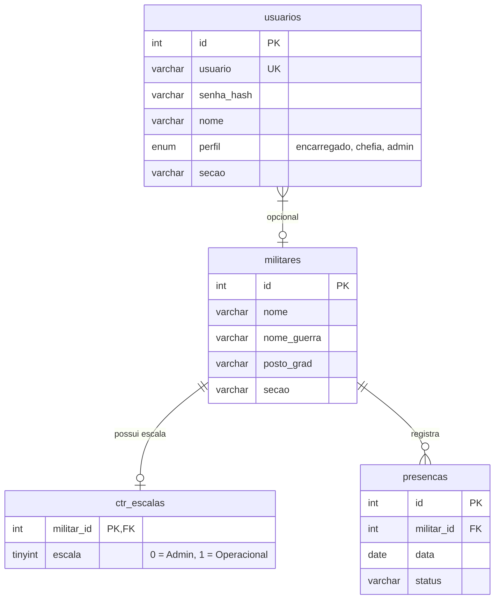

# Controle de Efetivo - DTCEA-SJ

Sistema integrado para controle diário de presença, afastamentos, escalas e consolidação de dados do efetivo militar do Destacamento de Controle do Espaço Aéreo de São José dos Campos (DTCEA-SJ), integrado com o SGP (Sistema de Gestão de Pessoas).

---

## 📋 Sumário
1. [Visão Geral](#-visão-geral)
2. [Funcionalidades Principais](#-funcionalidades-principais)
3. [Estrutura do Projeto](#-estrutura-do-projeto)
4. [Banco de Dados (Modelagem)](#-banco-de-dados-modelagem)
5. [Perfis de Acesso e Permissões](#-perfis-de-acesso-e-permissões)
6. [Endpoints da API](#-endpoints-da-api)
7. [Instalação e Configuração](#-instalação-e-configuração)
8. [Legenda de Status (Siglas)](#-legenda-de-status-siglas)

---

## 🔍 Visão Geral

O **Controle de Efetivo** foi desenvolvido para centralizar e facilitar o lançamento diário de presenças e indisponibilidades (férias, dispensas médicas, missões, etc.) dos militares de cada seção do destacamento. 

Ele compartilha a tabela de militares com o sistema de gestão do SGP, permitindo o reaproveitamento de dados pessoais e graduações já cadastradas, ao mesmo tempo em que gerencia as escalas administrativas e operacionais de forma separada.

---

## 🚀 Funcionalidades Principais

*   **Lançamento de Chamada Diária**: Registro ágil da presença do militar por seção com seleção rápida de status.
*   **Afastamento por Período**: Lançamento em lote de afastamentos (ex: período de férias ou licença médica) evitando retrabalho diário.
*   **Painel da Chefia (Dashboard)**: Estatísticas consolidadas da presença diária geral e por seção, com visualização rápida de quem está afastado e o motivo.
*   **Administração Geral**: Painel para gerenciamento de usuários (criação, edição de dados e redefinição de senhas) e militar (seção e tipo de escala).
*   **Importação via CSV**: Script de inicialização que importa e atualiza automaticamente os militares e o histórico a partir do CSV consolidado.

---

## 📂 Estrutura do Projeto

O sistema é estruturado em PHP puro para o back-end, utilizando banco de dados MySQL e uma interface minimalista e responsiva.

```text
ctr_efetivo/
├── public/
│   ├── assets/
│   │   └── css/
│   │       └── style.css            # Estilização visual (Vanilla CSS)
│   ├── .env                         # Configurações do ambiente (Banco de dados)
│   ├── .env.example                 # Exemplo de variáveis de ambiente
│   ├── admin.php                    # Gerenciamento de militares e usuários (Admin)
│   ├── api.php                      # Endpoints para ações assíncronas (chamadas/períodos)
│   ├── auth.php                     # Funções e regras de sessão e controle de acessos
│   ├── config.php                   # Configuração de banco, timezone e tratamento de dados
│   ├── dashboard.php                # Painel visual com relatórios e métricas para a Chefia
│   ├── database.sqlite              # Banco SQLite de referência (legado)
│   ├── db_init.php                  # Script CLI para criação do banco e importação do CSV
│   ├── index.php                    # Interface de chamada diária
│   ├── login.php                    # Autenticação de usuários
│   ├── logout.php                   # Encerramento de sessão
│   ├── help.php                     # Manual do usuário e glossário técnico
│   ├── dtcea_sj_logo.png            # Brasão / Identidade visual do DTCEA-SJ
│   └── Controle de Efetivo...csv    # CSV com histórico utilizado na inicialização
├── .gitignore
└── README.md                        # Documentação principal do sistema
```

---

## 💾 Banco de Dados (Modelagem)

O banco de dados utiliza a engine **InnoDB** com codificação **utf8mb4_unicode_ci**. O modelo de dados integra as seguintes tabelas:



### Detalhamento das Tabelas

1.  **`militares`** (Tabela compartilhada/adaptada do SGP)
    *   `id`: Identificador único (Chave Primária).
    *   `nome`: Nome completo do militar.
    *   `nome_guerra`: Nome de guerra utilizado.
    *   `posto_grad`: Posto ou Graduação (ex: SO, 1S, 2S, CB, S1).
    *   `secao`: Seção atual do militar (ex: ELETROMECÂNICA, SSTI, TWR, AIS, EMS).
2.  **`ctr_escalas`**
    *   `militar_id`: ID do militar (Chave Primária e Estrangeira).
    *   `escala`: Define se o regime é administrativo (`0`) ou escala operacional (`1`).
3.  **`usuarios`**
    *   `id`: Identificador do operador do sistema.
    *   `usuario`: Login único no sistema.
    *   `senha_hash`: Senha criptografada utilizando a função `password_hash()` do PHP.
    *   `nome`: Nome completo do operador.
    *   `perfil`: Regra de acesso (`encarregado`, `chefia`, `admin`).
    *   `secao`: Seção do operador (se atribuída, restringe o lançamento apenas para militares dessa seção).
4.  **`presencas`**
    *   `id`: Identificador único do registro.
    *   `militar_id`: ID do militar (Chave Estrangeira).
    *   `data`: Data da presença/afastamento.
    *   `status`: Código representativo da situação militar do dia (ver legenda).
    *   *Índice Único*: Uma constraint garante que não haverá duplicidade de status para um mesmo militar no mesmo dia (`militar_id` + `data`).

---

## 🔐 Perfis de Acesso e Permissões

O acesso às telas e ações é validado através de níveis hierárquicos armazenados na sessão:

*   **Encarregado Geral** (Ex: `encarregado`):
    *   Acesso à página principal (`index.php`) para lançar presenças de **qualquer seção**.
    *   Não possui acesso ao Painel da Chefia nem de Administração.
*   **Encarregado Setorial** (Ex: `encarregado_secao`):
    *   Restringe o lançamento de presenças e a visualização de militares **exclusivamente para a seção** atribuída ao usuário.
*   **Chefia** (Ex: `chefe`):
    *   Acesso ao `dashboard.php` para visualizar indicadores de presença diária, militares afastados e estatísticas gerais.
    *   Não pode fazer edições cadastrais.
*   **Administrador** (Ex: `admin`):
    *   Acesso irrestrito a todas as páginas do sistema.
    *   Gerenciamento total de cadastros de usuários e controle de seções de militares em `admin.php`.

---

## 🔌 Endpoints da API

A API (`api.php`) gerencia as requisições assíncronas feitas via AJAX no front-end. Todas as requisições exigem autenticação ativa.

### 1. Salvar Chamada Diária
*   **Método**: `POST`
*   **Parâmetro de Ação**: `api.php?action=save_call`
*   **JSON no Body**:
    ```json
    {
      "date": "YYYY-MM-DD",
      "presencas": {
        "militar_id_1": "STATUS_CODIGO",
        "militar_id_2": "STATUS_CODIGO"
      }
    }
    ```
*   **Retorno**: `{"success": true, "message": "Chamada salva com sucesso!"}`

### 2. Lançar Período de Afastamento/Indisponibilidade
*   **Método**: `POST`
*   **Parâmetro de Ação**: `api.php?action=save_period`
*   **JSON no Body**:
    ```json
    {
      "militar_id": 12,
      "status": "STATUS_CODIGO",
      "date_start": "YYYY-MM-DD",
      "date_end": "YYYY-MM-DD"
    }
    ```
*   **Retorno**: `{"success": true, "message": "Período de indisponibilidade gravado com sucesso!"}`

---

## 🛠️ Instalação e Configuração

### Pré-requisitos
*   Web Server (Apache/Nginx) com suporte a **PHP 7.4 ou superior**.
*   Servidor **MySQL/MariaDB**.

### Passo a Passo

1.  **Clonar ou copiar os arquivos** para o diretório de publicação do servidor (Ex: `C:\xampp\htdocs\ctr_efetivo`).
2.  **Configurar Variáveis de Ambiente**:
    *   Copie o arquivo `.env.example` criando um novo `.env` na pasta `/public`.
    *   Configure os dados de acesso ao seu servidor MySQL:
        ```ini
        DB_HOST=127.0.0.1
        DB_PORT=3306
        DB_DATABASE=sgp_dtceasj
        DB_USERNAME=root
        DB_PASSWORD=
        ```
3.  **Criar o banco de dados**:
    *   Certifique-se de criar o banco de dados MySQL de acordo com o nome inserido no `.env` (ex: `sgp_dtceasj`).
4.  **Inicializar o banco e importar o CSV**:
    *   Execute o script `db_init.php` para estruturar as tabelas e importar o histórico inicial:
        ```bash
        php public/db_init.php
        ```
5.  **Acessar a Aplicação**:
    *   Acesse `http://localhost/ctr_efetivo/public/` no seu navegador.
    *   Utilize uma das credenciais padrão configuradas na tabela:
        *   **Admin**: Login `admin` / Senha `senha123`
        *   **Chefe**: Login `chefe` / Senha `senha123`
        *   **Encarregado Geral**: Login `encarregado` / Senha `senha123`
        *   **Encarregado Setorial**: Login `encarregado_selm` / Senha `senha123`

---

## 🏷️ Legenda de Status (Siglas)

O sistema opera com uma lista padronizada de situações diárias do efetivo:

| Sigla | Descrição | Categoria |
| :--- | :--- | :--- |
| **P** | Presente | Presença Regular |
| **EA** | Expediente Admin | Presença Regular |
| **HO** | Home Office | Presença Regular |
| **O** | Operacional | Presença Regular |
| **A** | Ausente | Falta / Pendência |
| **PA** | Falert A | Falta / Pendência |
| **PB** | Falert B | Falta / Pendência |
| **F** | Férias | Afastamento Planejado |
| **DM** | Dispensa Médica | Dispensa / Saúde |
| **LPM** | Licença | Dispensa / Saúde |
| **DP** | Dispensa Parcial | Dispensa / Saúde |
| **INS** | Instalação | Dispensa / Outros |
| **D** | Dispensado | Dispensa / Outros |
| **SV** | Serviço | Escala / Serviço |
| **SSV** | Saindo de Serviço | Escala / Serviço |
| **FS** | Folga Sobreaviso | Escala / Serviço |
| **C** | Curso | Curso / Missão |
| **M** | Missão | Curso / Missão |
| **FM** | Formatura | Atividade Coletiva |
| **FR** | Feriado | Feriado |
